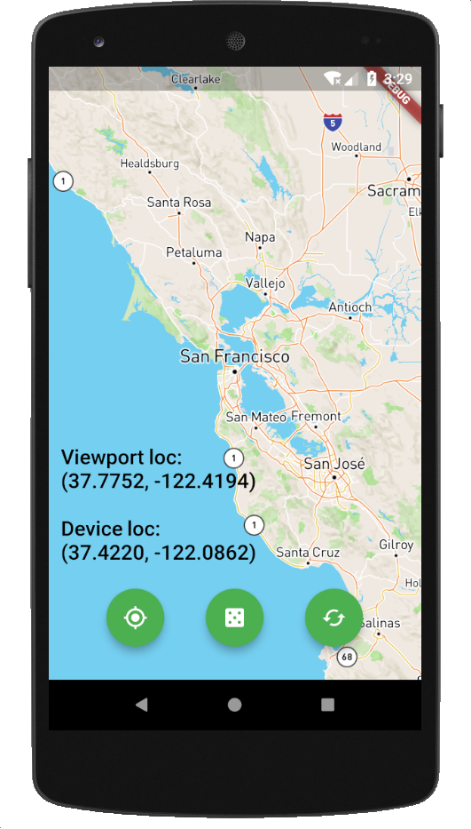
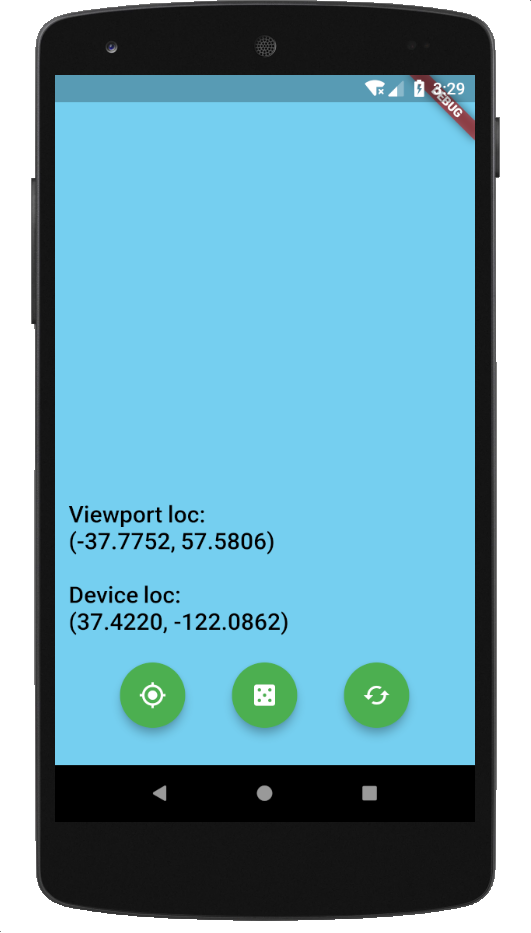

# Otherside

A mapping app written in Flutter that allows exploration of the other side of the Earth for a given location. Currently only builds for Android due to [lack of iOS support](https://github.com/mapbox/flutter-mapbox-gl/issues/12) for Mapbox's inline map Flutter widget.

## Install

In order to build and run the app:
```
./flutterw run
```

## Screenshots

 
